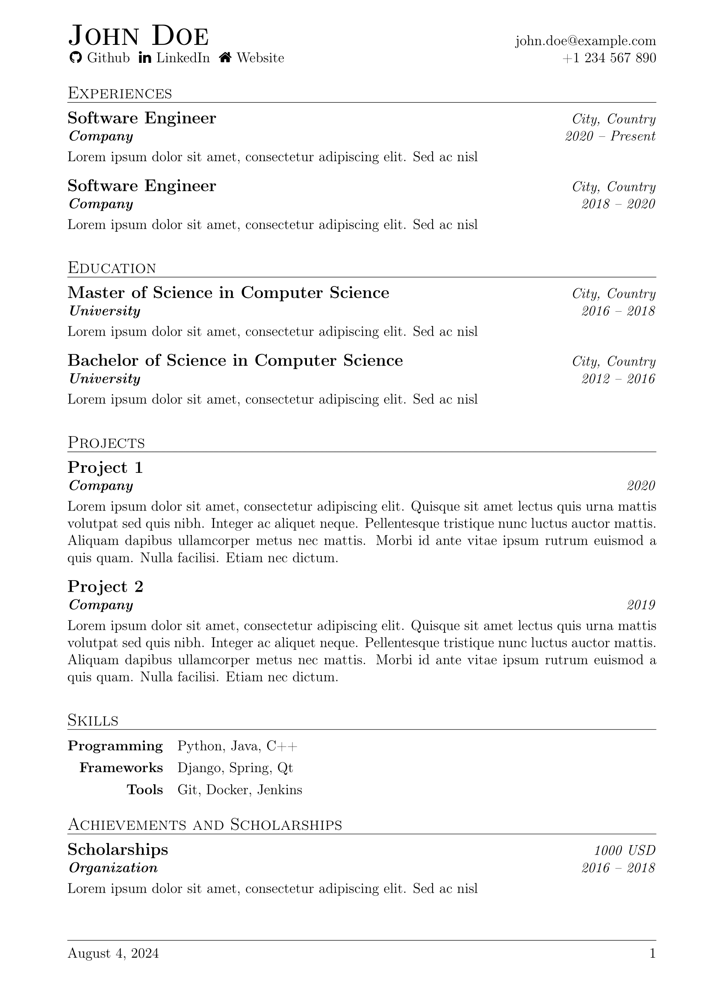

# Currivitae
Simple LaTeX resume templates.

## Classic

*Could be found in the [`currivitae-classic.cls`](classic-example.tex) class.*

## Elegeant

*Could be found in the [`currivitae-elegant.cls`](elegant-example.tex) class.*

## Usage
See the [`classic-example.tex`](classic-example.tex) and [`elegant-example.tex`](elegant-example.tex) files for examples of how to use these templates.
